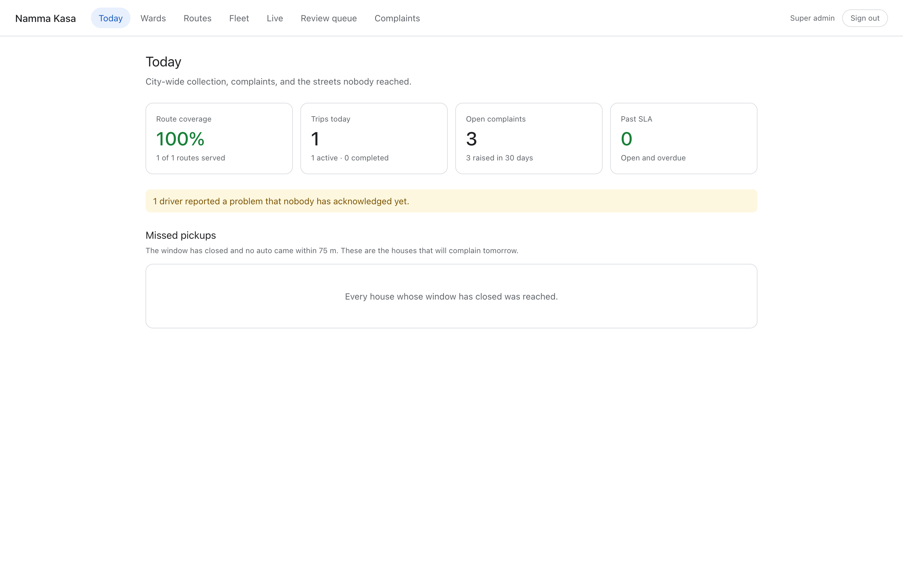
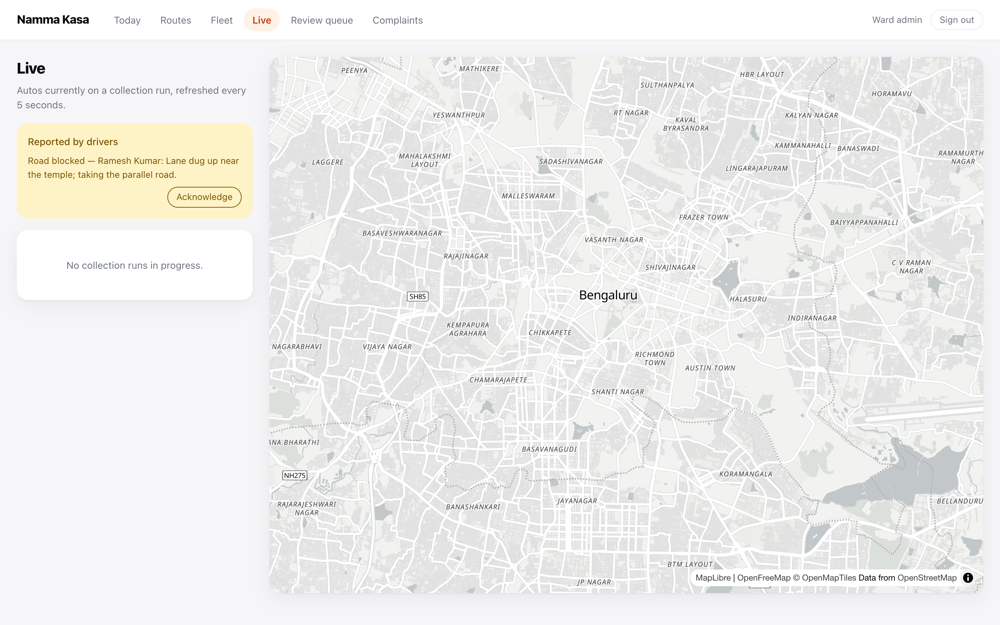
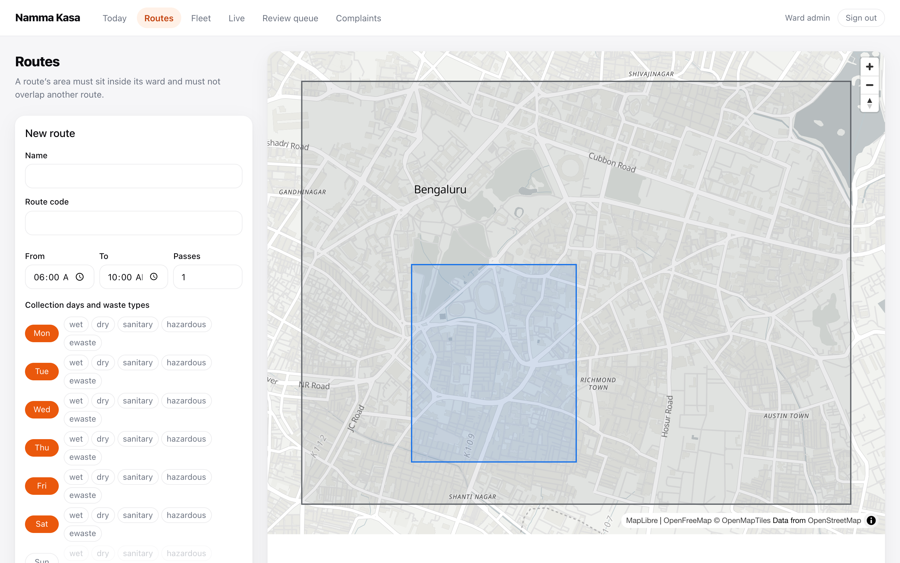
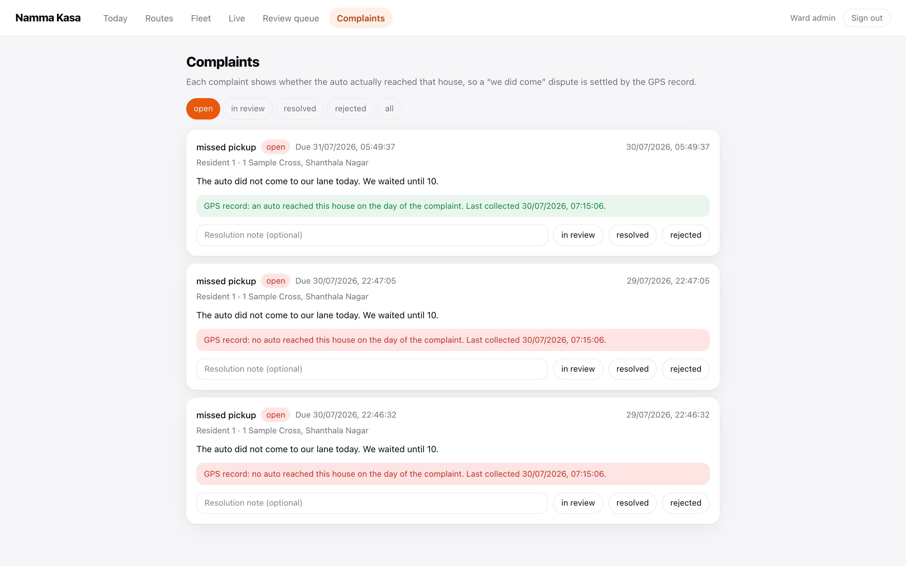
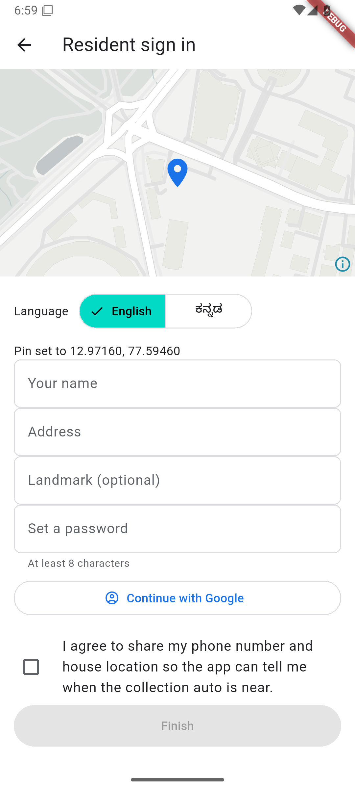
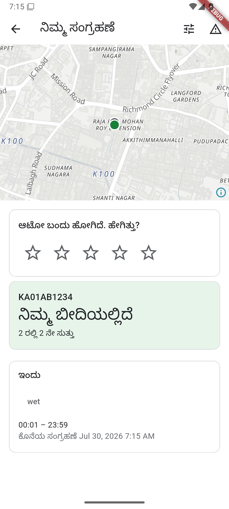

# Namma Kasa — ನಮ್ಮ ಕಸ

Live tracking of door-to-door waste collection in Bengaluru.

Residents stop waiting at the gate, because the app tells them when the collection
auto is close. Operators stop being able to claim service that did not happen,
because every trip leaves a GPS trail that says otherwise.

## Stack

| Layer | Tech |
|---|---|
| Mobile (Android) | Flutter — `apps/mobile` |
| Admin portal | Next.js + React + Tailwind — `apps/web` |
| Backend | NestJS modular monolith — `apps/api` |
| Contracts | Zod → OpenAPI → generated Dart client — `packages/shared`, `contracts/` |
| Data | PostgreSQL 16 + PostGIS + TimescaleDB, Redis |
| Realtime | MQTT (EMQX) ingest, WebSocket fan-out, FCM push |
| Maps | MapLibre + OpenFreeMap tiles |

The backend owns the contract: Zod schemas generate the OpenAPI document, which
generates the Flutter client. `pnpm contracts:check` fails the build if they drift.

## Prerequisites

```sh
brew install colima docker docker-compose openjdk   # openjdk is only needed to regenerate the Dart client
brew install --cask flutter
npm i -g pnpm
```

Colima replaces Docker Desktop, whose installer needs an interactive sudo password.

## Getting started

```sh
pnpm install
colima start                                  # boots the Docker VM
cp .env.example .env
docker compose up -d                          # postgres+postgis+timescale, redis, emqx, minio

pnpm --filter @namma-kasa/api migrate
pnpm --filter @namma-kasa/api seed             # prints dev logins

pnpm --filter @namma-kasa/api dev              # API on :4000
pnpm --filter @namma-kasa/web dev              # portal on :3000
cd apps/mobile && flutter run --dart-define=API_BASE=http://<LAN-IP>:4000/v1
```

Postgres is published on **5433**, not 5432, because a host Postgres commonly
occupies the default port.

### Dev accounts (created by the seed)

| Role | Phone | Password |
|---|---|---|
| Super admin | 919000000001 | devpassword |
| Ward admin | 919000000002 | devpassword |
| Residents | 919888800001–3 | devpassword |
| Driver (pre-provisioned, no account) | 919999900001 | register in the app |

SMS is not wired in development: `OTP_SENDER=console` prints codes to the API log
as `[dev-otp] <phone> <code>`.

## Screenshots

Captured from a running stack with live data (`scripts/portal-screenshots.mjs`).

| | |
|---|---|
|  |  |
|  |  |

And the Flutter app running on an Android emulator against the same stack —
the resident home in Kannada, with a live auto at the gate and the rating
prompt the 75 m evidence rule triggers:

| | |
|---|---|
|  |  |

The full set — login, home, wards, fleet, review queue, and more app screens —
is in [docs/screenshots/](docs/screenshots/).

## Documentation

| Document | Covers |
|---|---|
| [docs/architecture.md](docs/architecture.md) | How it fits together, with diagrams: system context, the path a GPS ping takes, the contract pipeline, the data model |
| [docs/operations.md](docs/operations.md) | Local setup, migrations, deploy, monitoring, and a runbook for the failures worth knowing |
| [specs/001-waste-collection-tracking/](specs/001-waste-collection-tracking/) | Requirements, plan, data model, and the task history that built it |

## Repo layout

```
apps/api        NestJS: auth, geo, fleet, tracking, notify, complaints, issues, compliance
apps/web        Admin portal: dashboard, wards, routes, fleet, live, review queue, complaints
apps/mobile     Flutter app: resident and driver, single binary
packages/shared Zod contracts, shared by API and portal
contracts/      Generated OpenAPI document (committed)
docs/           Architecture and operations
```

## Commands

```sh
pnpm typecheck && pnpm lint && pnpm build   # TS workspaces
pnpm --filter @namma-kasa/api test          # 227 tests against live Postgres/Redis/EMQX/MinIO
pnpm --filter @namma-kasa/api coverage      # line coverage by file
pnpm contracts:check                        # OpenAPI in sync, and every served route documented
pnpm contracts:generate                     # regenerate OpenAPI + Dart client
cd apps/mobile && flutter analyze && flutter test   # 49 tests
```

## Status

Feature-complete against `specs/001-waste-collection-tracking/spec.md`: the
database schema with its geo invariants enforced in triggers, auth, ward-scoped
authorization with audit logging, the ward/route/fleet admin surface, driver trip
tracking with MQTT ingest, the resident live map, proximity and arrival alerts,
complaints with SLA tracking, ratings, missed-pickup detection, and DPDP erasure.

All 114 tasks are done. Push and Google Sign-In are implemented behind seams
with working fakes, so the flows are complete and tested; supplying a Firebase
project and an OAuth client id swaps in the live transport without touching a
caller. See Known gaps in [docs/operations.md](docs/operations.md).

Not yet built, and deliberately deferred past pilot: infrastructure-as-code,
blue-green deploys and PITR.
