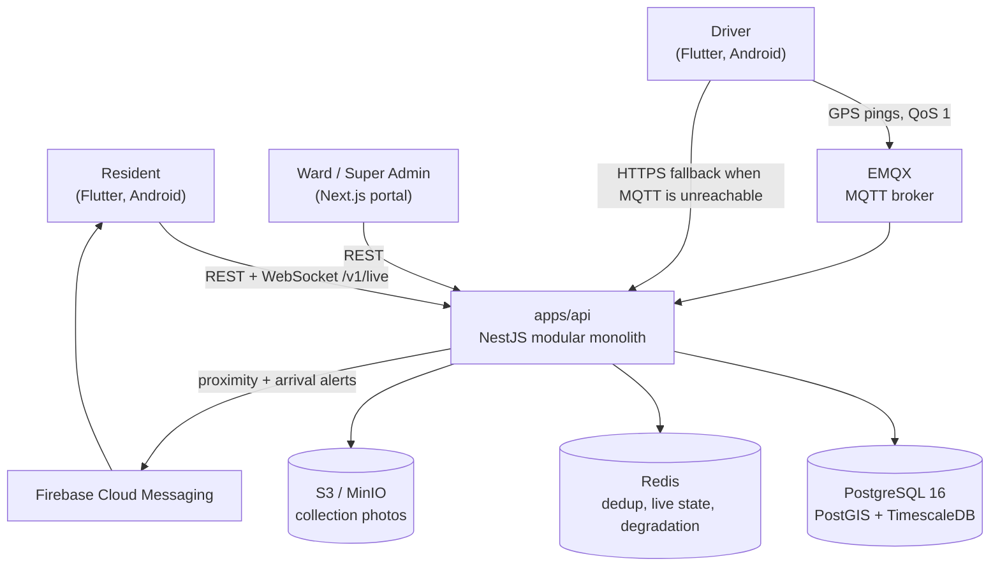
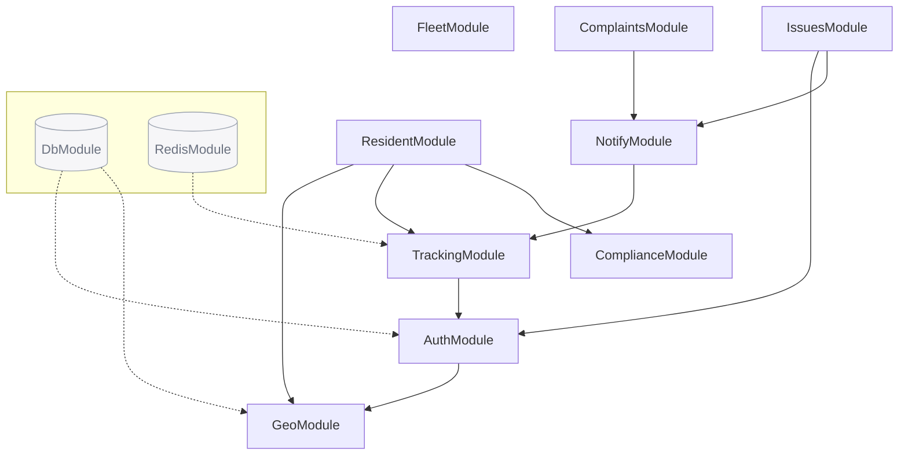
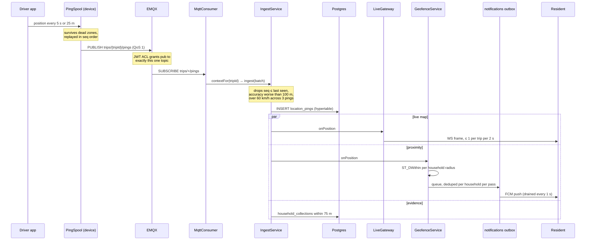
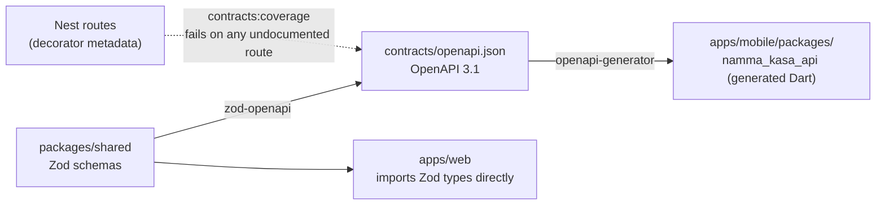
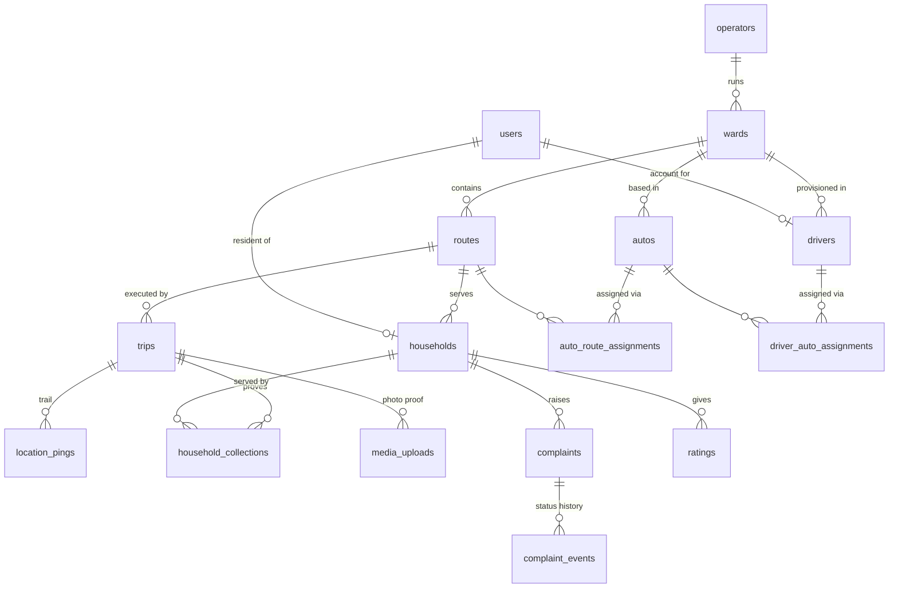
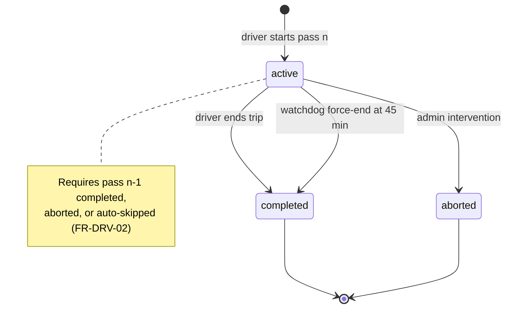
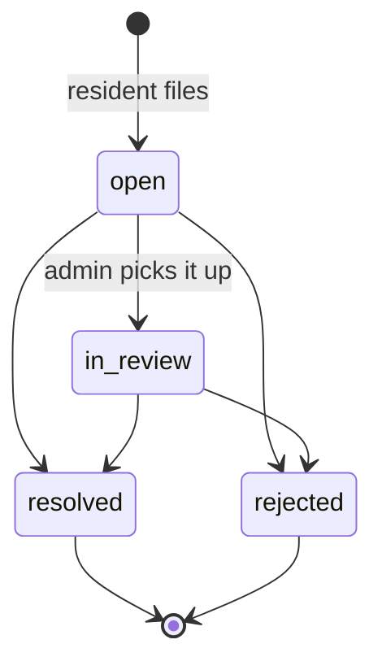
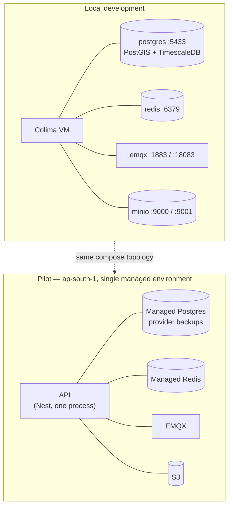
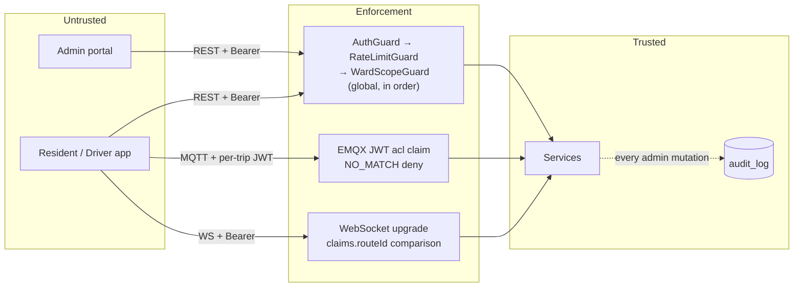
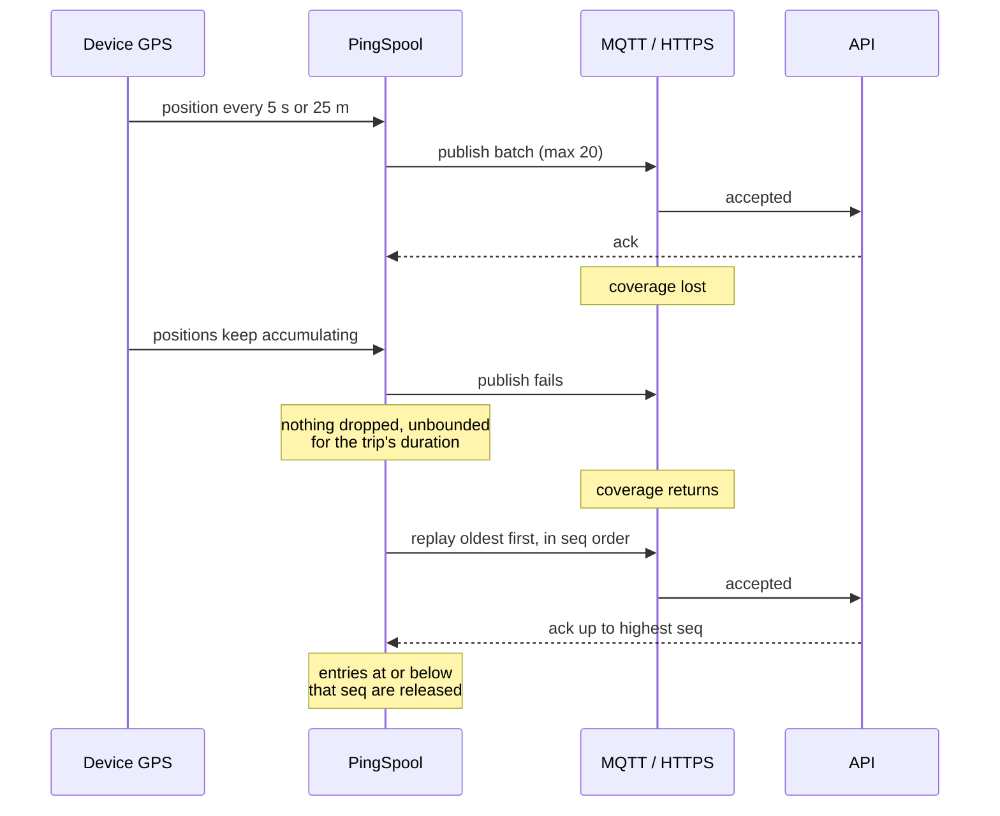

# Architecture

How Namma Kasa is put together, and why. For setup and day-to-day operation see
[operations.md](./operations.md); for the requirements this implements see
[`specs/001-waste-collection-tracking/spec.md`](../specs/001-waste-collection-tracking/spec.md).

**Diagrams** — [system context](#system-context) ·
[module graph](#module-graph) ·
[the path a GPS ping takes](#the-path-a-gps-ping-takes) ·
[contract pipeline](#contract-pipeline) ·
[data model](#data-model) ·
[trip lifecycle](#trip-lifecycle) ·
[complaint lifecycle](#complaint-lifecycle) ·
[deployment](#deployment) ·
[trust boundaries](#trust-boundaries) ·
[surviving a dead zone](#surviving-a-dead-zone)

All ten are Mermaid, so they render on GitHub and stay diffable in review.
`pnpm diagrams:check` renders each one to prove it parses — a diagram that looks
right in a code fence is exactly as verified as a route that typechecks.

## The problem shape

Two facts drive every decision below.

**Residents wait.** Door-to-door collection has no timetable a resident can rely
on, so they either stand at the gate or miss the auto. Fixing that needs a live
position, pushed, with enough warning to walk down — not a map they must open.

**Operators cannot currently be held to account.** "We came" and "you did not"
are unfalsifiable claims. Every trip therefore leaves a GPS trail, and a
complaint is answered by that trail rather than by argument.

The second fact is why ingest is protected above everything else: losing a ping
loses evidence.

## System context



The backend is a **modular monolith**, not services. At pilot scale — one city,
~225 wards, a few thousand autos — the coordination cost of services buys
nothing, and the ingest path benefits from being a single process that can hand a
position to the geofence without a network hop. The module boundaries are real
(`apps/api/src/modules/*`), so splitting later is a refactor rather than a
rewrite.

### Module graph

The boundaries are real, and their direction is load-bearing.



**`NotifyModule` importing `TrackingModule` is the constraint everything else
bends around.** Ingest emits positions, the geofence consumes them, so notify
must depend on tracking and never the reverse. That is why driver quick-reports
live in their own `IssuesModule`: the feature needs `NotifyService`, and putting
it in `TrackingModule` would have closed a cycle.

`ResidentModule` imports `ComplianceModule` for `RollupsService` — which
`ComplianceModule` must therefore **export**. It did not, for three phases, and
the API could not start; nothing caught it because no test had ever called
`NestFactory.create`. `test/http*.spec.ts` now boots the real container.

## The path a GPS ping takes

This is the product. Everything else is administration around it.



Three design points worth stating explicitly:

**The spool is unbounded for the trip's duration.** A driver through a dead zone
must not lose the trail, because the trail is the evidence. Replay is in
sequence order, and the server drops anything at or below the highest sequence
it has already accepted for that trip.

**Dedup is per household per *pass*, not per trip.** Two autos can serve one
pass of a route, and a resident should be told once that collection is coming,
not once per vehicle. The claim is a Redis `SET NX` that outlives the collection
day.

**The two alert rings are independent.** The proximity heads-up uses each
household's own radius (100–1000 m, default 300 m); the "arrived at your street"
alert uses a fixed 75 m. They hold separate dedup keys — sharing one would mean
whichever fired first silently suppressed the other.

## Contract pipeline

The backend owns the contract. This is Constitution Principle IV, and it is
enforced by the build rather than by convention.



Two guards run in `pnpm contracts:check`:

- **`contracts:check`** regenerates the document and diffs it, so a changed Zod
  schema without a regenerated contract fails.
- **`contracts:coverage`** enumerates the routes Nest actually serves by reading
  decorator metadata, and fails if one is missing from the document. This exists
  because the first guard only compared the document to its own generator — 45
  of 50 routes were undocumented while it reported success.

Currently **49 path templates covering 56 routes**, with 1 deliberate exclusion
(`GET /v1/metrics`, the Prometheus scrape target).

Hand-editing anything under `apps/mobile/packages/namma_kasa_api` is a defect.
Change the Zod schema and run `pnpm contracts:generate`.

### Generator constraints

The `dart` generator emits uncompilable code for several valid OpenAPI shapes,
so the published document is deliberately looser than runtime validation in
three places — a record of enum arrays, an enum carrying a default, and 4-deep
GeoJSON coordinate arrays. `packages/shared` still validates strictly. The
mobile client is also generated from an admin-stripped view of the spec, since
the app is a resident and driver client and never calls `/admin`.

`flutter analyze` **excludes** the generated package. Only `flutter test`
compiles it, so analyze passing says nothing about whether generated code builds.

## Data model

22 application tables. The core of it:



**Geometry is enforced in the database, not the service layer.** Ward boundaries
may not overlap, route serviceable areas may not overlap within a ward, and a
route must sit inside its ward. These are triggers, so a bug in an endpoint
cannot corrupt the geography.

The overlap check uses `ST_Relate(a, b, 'T********')` rather than `ST_Overlaps`,
because `ST_Overlaps` is false when one polygon wholly contains another — which
is exactly the case an admin most needs rejecting.

**Assignments are time-bounded and never rewritten.** `effective_from` /
`effective_to` with a partial unique index on the open row. A reassignment
closes the current row and opens a new one, so history stays reconstructable
(SC-010).

**`location_pings` is a TimescaleDB hypertable** partitioned by `recorded_at`,
holding plain `lat`/`lng` doubles rather than a geometry column. Raw pings are
dropped after 90 days; the derived `household_collections` evidence is not.

## Load shedding

Under pressure the live map degrades before anything else, because a resident
can refresh a map but cannot recover a lost alert or a lost trail.

| Level | Name | Effect |
|---|---|---|
| 0 | `normal` | Everything on; live frames every 2 s |
| 1 | `slowLive` | Live cadence stretches to 10 s |
| 2 | `pauseLive` | Resident sockets closed; app falls back to polling |
| 3 | `minimal` | Admin dashboards drop to counts only |

Ingest and notifications are never shed. The level lives in Redis
(`degradation:level`) and the gateway re-reads it on a 30 s heartbeat, so the
hot path never awaits Redis per frame.

## Authorization

Three enforcement points, deliberately different in kind:

- **Route guards** — role checks plus a `WardScopeGuard` that pins a Ward Admin
  to their own ward server-side (FR-WARD-06). The portal's client-side gate is
  cosmetic; the API rejects regardless.
- **Broker ACL** — a driver's MQTT token carries `acl.pub` granting exactly one
  topic, `trips/{tripId}/pings`. A compromised device can publish to one trip.
  EMQX is configured `NO_MATCH: deny` with `DENY_ACTION: disconnect`.
- **WebSocket upgrade** — a resident may only subscribe to the route their own
  household sits on. This is a JWT claim comparison rather than a broker rule,
  because it is far easier to audit.

Access tokens live 15 minutes with rotating refresh tokens. Sockets outlive
tokens, so they are cycled after 60 minutes with a `reauth` frame.

Residents never receive driver personal details — only the auto's registration
number and its position (FR-RES-07, a DPDP obligation).

## Trip lifecycle

A trip is the unit of evidence, so how it ends matters as much as how it runs.



The watchdog sweeps every 30 s and escalates rather than jumping straight to
force-ending, because a silent phone and an abandoned auto look identical from
the server:

| Elapsed | Signal | Who sees it |
|---|---|---|
| 3 min without a ping | "Tracking dropped" | Ward dashboard |
| 30 min without movement | Confirmation prompt | Driver's phone |
| 45 min unreachable | Force-end as `auto_idle` | Recorded on the trip |

`route_pass_days` tracks each pass separately (`pending → active → completed /
aborted / skipped`), and a pass whose window elapses unstarted is marked
`skipped` so the next pass is not blocked forever.

## Complaint lifecycle



Transitions are enforced server-side — `resolved` and `rejected` are terminal, so
a closed complaint cannot be reopened to game the SLA clock. `sla_due_at` is
stamped **at creation** from the owning operator's configured hours, not derived
on read, so a later policy change cannot silently re-date complaints raised under
the old one. Breach and escalation are computed in SQL against one clock rather
than the browser's.

Every complaint carries the GPS verdict for the day it was raised, so
"we did come" is settled by the trail rather than by argument.

## Deployment



Postgres is published on **5433** locally because a Homebrew Postgres commonly
owns 5432. Infrastructure-as-code, blue-green deploys and PITR are deliberately
deferred past pilot — required before city rollout, not before the first ward.

Deploy order is fixed by the generated contract: **migrations → API → portal →
mobile build**. Older app versions must keep working, so a contract change that
breaks them is a breaking change.

## Trust boundaries

Authorization is enforced in three different places, deliberately in three
different ways.



- **Route guards** run globally in order: authenticate, rate-limit, then scope a
  Ward Admin to their own ward. The portal's own gate is cosmetic.
- **Broker ACL** grants a driver's token publish rights to exactly one topic,
  `trips/{tripId}/pings`. A compromised device can publish to one trip, and EMQX
  disconnects on any other topic rather than silently dropping.
- **WebSocket upgrade** compares a JWT claim instead of consulting broker rules,
  because a claim comparison is far easier to audit.

Residents never receive driver personal details — only the auto's registration
number and its position (FR-RES-07, a DPDP obligation).

## Surviving a dead zone

The trail is the evidence, so the app is built to lose none of it.



The server drops any ping whose sequence is at or below the highest it has
already accepted for that trip, so a QoS-1 redelivery or an over-eager replay
costs nothing. That per-trip ceiling lives in Redis and **outlives a test run** —
a suite whose sequence numbers restart lower has every ping dropped in silence.

## Where things live

```
apps/api/src/modules/
  auth        OTP, password/Google, rotating refresh, driver pre-provisioning
  geo         wards, routes, households, operators, mapping
  fleet       autos, drivers, time-bounded assignments
  tracking    trips, MQTT + HTTPS ingest, live gateway, media, watchdog
  notify      geofence, notification outbox, push, advisories
  complaints  complaints, ratings, SLA, Sahaaya seam
  issues      driver quick-reports (breakdown, road blocked)
  compliance  DPDP erasure, retention, Prometheus metrics, dashboards

apps/web/src/app/     portal: dashboard, wards, routes, fleet, live,
                      review-queue, complaints
apps/mobile/lib/src/  resident/ and driver/ surfaces, shared core/
packages/shared/      Zod contracts — the single source of truth
contracts/            generated OpenAPI document (committed)
```

## Testing posture

Constitution V requires integration coverage of trip tracking and proximity
notification end-to-end before release. `apps/api/test/end-to-end.spec.ts` is
that gate: it publishes over MQTT exactly as `trip_tracker.dart` does and
asserts both the resident's WebSocket frame and the queued alert.

`apps/api/test/http*.spec.ts` boot the real `AppModule` and drive it over HTTP,
so controllers, guards, the validation pipe and the audit interceptor execute
against real requests. That matters because authorization lives there: a service
that refuses correctly is no use if the route never reaches it. Booting the app
in a test immediately found a module that had never been exported, which meant
the API could not start — after 172 tests, a clean typecheck, lint, build and
contract check had all passed.

Run `pnpm --filter @namma-kasa/api coverage` for the current picture (~86% lines).
Coverage is a script rather than an ad-hoc command because reading code for these
gaps failed repeatedly — several defects were found only by measuring what the
tests actually execute, including one endpoint that had never worked at all.

Two things about the test harness, both load-bearing:

- `unplugin-swc` is in `vitest.config.ts` because Nest resolves constructor
  dependencies from `design:paramtypes`, which esbuild does not emit. Without it
  every injected dependency is `undefined`.
- `@namma-kasa/shared` is aliased to its source rather than its CJS `dist`. Left
  as dist it loads a second copy of zod, so a `ZodError` from a shared schema is
  not an instance of the one `ProblemFilter` checks, and every validation failure
  renders 500 instead of 422 — under test only.

Two things that make test failures silent, worth knowing before debugging one:

- Ingest keeps the highest accepted `seq` per trip in Redis, and that key
  outlives a test run. A suite whose sequence numbers restart lower has every
  ping dropped as a duplicate, with no error.
- Proximity dedup keys are claimed per household per pass and likewise persist.
  A test asserting an alert must clear the claims for every household on the
  route, not only its own fixture.
